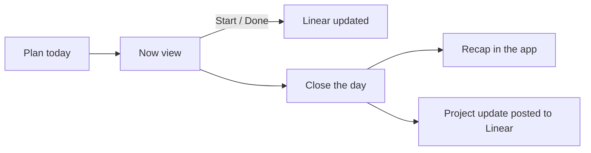

# Needle Mover

A personal web app that ranks the day's work from Linear across several
ventures: one needle mover plus three others, each with a reason and a first
step. Marking something done updates Linear. Closing the day writes a recap and
posts it back to Linear as a project update.

Built for a laptop browser. It works on a phone, but a phone is not the point.

## The problem

Three ways a day goes sideways, and the response to each:

| Derailer | Response |
| --- | --- |
| Too many ventures competing | One needle mover, ranked across every venture against their project targets. Three more underneath it, from at most two ventures. |
| Hard to start the big task | Every task carries a first step that takes under 10 minutes and starts with a verb. |
| Losing track mid-day | One screen that shows the day's work and nothing else. |

## The loop

Open the app. Plan the day. Work. Mark things done. Close the day.

There is no scheduler. Nothing happens unless you open the app, which is
deliberate — see *What was removed* below.

### Planning the day

Syncs every connected Linear team, scores what is open and assigned to you,
and asks Claude to choose from the top of that ranking. It returns:

- **The needle mover** — title, venture, the project target it advances, and
  why it outranked everything else.
- **A first step** — one physical action under 10 minutes.
- **Three more tasks**, best first, each with one clause on why it earned a
  place, written to be read once the needle mover is finished.
- **A plain-words line** describing the needle mover without jargon or client
  names.

### The Now view

One card: the needle mover, its first step, and three actions.

- **Start** marks the issue in progress in Linear.
- **Blocked** asks for a one-line reason. It does not touch Linear — being
  blocked is a fact about your day, not a workflow state, and guessing at a
  "Blocked" column in someone's team would be wrong. The reason appears in the
  recap.
- **Done** completes the Linear issue.

Below it, the three other tasks, each startable in place. The list opens itself
once the needle mover is done, because that is the moment it is for.

**Share** copies a picture of today's task to the clipboard. It is a
purpose-built card, not a screenshot of the view: a literal capture carries the
app's chrome and, if the list is open, the other three tasks, which can name
ventures a recipient was never meant to see.

### Closing the day

The recap appears in the app and posts to Linear as a project update, one per
project that had work closed in it. It covers whether the needle mover was
finished and what blocked it, what closed today grouped by project, and how
each project target moved.

A closed day can be reopened. Closing is a judgement, not a fact about the
world.

## Ranking

Impact means how much a task moves a Linear project toward its target.
Selection happens in two passes: code scores every candidate and builds a
shortlist, then Claude picks from that shortlist and explains the choice. This
keeps cost low and every pick explainable.

### Candidates

Open issues assigned to you across every connected team, excluding anything
blocked by another open issue.

### Score

| Factor | Signal | Weight |
| --- | --- | --- |
| Goal leverage | Issue belongs to a project with a target date; issue priority; share of project scope | 38.9% |
| Deadline pressure | Days until the project target or issue due date, decaying to zero at 30 days | 27.8% |
| Unblocks others | How many open issues this one blocks, saturating at 3 | 16.7% |
| Momentum | Already in progress, plus a boost per consecutive carry-over day | 16.6% |

Two rules that matter more than the numbers:

**Missing estimates score neutral, not zero.** Penalising an unestimated issue
would bury most of a real backlog.

**Goal leverage is renormalised away when too little of the backlog is
targeted.** It gates entirely on a project target date, so without this, 38.9%
of the score silently collapses to zero for nearly every candidate. The gate is
proportional to backlog size — an absolute floor is unreachable on a small
backlog, which means goal leverage could never switch on however well the
projects were kept.

### Guardrails

- **Carry-over:** an unfinished needle mover gets a momentum boost the next
  day. After three days the app asks you to split it or drop its priority.
- **Manual swap:** the needle mover can be replaced, and each swap is logged
  with what was chosen instead — the clearest signal the ranking was wrong.

## Integrations

| Service | Used for | Auth |
| --- | --- | --- |
| Linear | Read issues, projects, targets and relations. Update issue state. Post project updates. | One personal API key per team, encrypted at rest |
| Supabase | Database and sign-in | Google, restricted to one address |
| Claude | Ranking and the recap narrative | API key |

Linear webhooks are optional and keep the cache fresh between plans.

### Claude usage

- **Daily pick:** one call with the shortlist and project targets, returning
  structured JSON.
- **Recap:** one call at close of day.

## What was removed, and why

After a week of real use, the scheduler, Google Calendar, browser push and all
outbound email were removed. The reasoning is the most useful part of this
document.

**Do not rebuild systems the user already has.** Meetings live in a calendar
with reminders attached, so repeating them on a dashboard is noise. The same
test killed the morning brief email: an email telling you to open an app is a
notification with extra steps.

**Do not supply discipline the user is meant to bring.** Nudges can be ignored
anyway, so they buy nothing and cost a whole subsystem. Suggesting a focus
window was the same overreach one layer down — deciding *when* someone should
work was never the app's call. That is why the calendar went and not merely the
notifications.

**The job is to make the right thing visible when you look, not to make you
look.** After the four tasks, Linear is right there.

Gone with them: the morning brief, the midday nudge, the close-day reminder,
the backup task, the suggested focus window, and every scheduling column in the
database.

## Build phases

| Phase | Scope | Status |
| --- | --- | --- |
| 1. Core pick | Sign-in, Linear sync, scoring plus the Claude pick, the Now view | Done |
| 2. Full picture | All teams, webhooks, progress snapshots, close day with a recap | Done |
| 3. Sharing | The share card. Guest links were largely replaced by posting the recap to Linear, where collaborators already are. | Partly done |
| 4. Capture | Quick-capture text and voice, parsed by Claude into proposed issues, held in an approval inbox until approved | Not started |
| 5. Tuning | The three-day split prompt, the swap log, weights adjusted from what actually gets swapped away | Not started |

**Out of scope:** reading chat apps directly, a native mobile app, and multiple
users. It is one instance per person by design.
