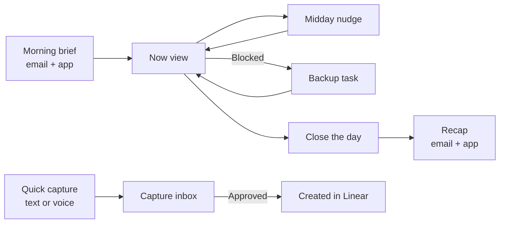

# Needle Mover App — Product Spec

2026-09-16 · @u_KzAeK5y7Hzvry5uD36b0_A

## Overview

A personal web app that picks one needle mover each morning, keeps it in front of TP all day, and reports each night what actually moved. It pulls tasks from several Linear workspaces and Google Calendar. Claude ranks work by impact against each venture's Linear project targets, and the app reaches TP by email and browser notification.

Each design choice answers one of the three ways a day goes sideways:

| Derailer | Design response |
| --- | --- |
| Too many ventures competing | One needle mover per day, ranked across all ventures against their goals. Everything else is hidden in an "also today" drawer, capped to two ventures. |
| Hard to start the big task | Every needle mover comes with a first step that takes under 10 minutes. |
| Losing track of priorities mid-day | A Now view that shows only the current task, plus one midday nudge. |

The app is built for a laptop browser first, because TP wants less phone time. It still works on mobile, but mobile is not the target.

## Daily loop

The day has four touchpoints: a morning brief at a fixed time, a Now view that holds focus, a capture inbox, and a recap that TP triggers by closing the day.

Captures run alongside the loop at any time. Nothing reaches Linear until TP approves it.

### Morning brief

Sent at a fixed time TP sets, in the time zone of his primary Google Calendar. It goes out by email and appears in the app. It contains:

- **The needle mover:** title, venture, the Linear project target it advances, and why it outranked everything else.
- **First step:** one concrete action under 10 minutes.
- **Focus window:** the largest free calendar block today, suggested as the time to do it.
- **Inbox count:** how many captures are waiting for approval.

The backup task is chosen but not shown.

### Now view

The app's home screen. It shows one card: the needle mover, its first step, and three actions.

- **Start:** marks the task in progress in Linear.
- **Blocked:** asks for a one-line reason and reveals the backup task.
- **Done:** marks the Linear issue complete.

The "also today" drawer stays collapsed below the card. A single midday browser notification asks whether TP is still on the needle mover. It is skipped if the task is already done.

### Capture inbox

Two ways in: a text box on a keyboard shortcut, and a voice-note button. Claude turns each capture into a proposed issue with a title, venture, Linear project and optional due date. TP approves, edits or discards each one. Approved items are created in the right Linear workspace.

### Close the day

TP presses "Close day" when he is done. The recap appears in the app and is emailed. It covers:

- Whether the needle mover was finished, and the blocker if not.
- Linear issues closed today, grouped by venture.
- Progress on each affected project target, before and after today.
- A candidate needle mover for tomorrow.

If the day is not closed by a cutoff time, the app sends one reminder. If it is still open the next morning, the brief opens with an automatic recap of yesterday.

## Prioritization logic

Impact means how much a task moves a Linear project toward its target. Selection happens in two passes: code scores every candidate and builds a shortlist, then Claude picks from that shortlist and explains the choice. This keeps AI cost low and every pick explainable.

### 1. Gather candidates

All open issues across every connected workspace that are assigned to TP and not done or canceled. Issues blocked by another open issue are excluded.

### 2. Score and shortlist

Each candidate gets a weighted score. The 15 highest go to Claude. The weights below are starting values and can be tuned later.

| Factor | Signal | Starting weight |
| --- | --- | --- |
| Goal leverage | Issue belongs to a project with a target; issue priority; share of project scope | 35% |
| Deadline pressure | Days until the project target date or issue due date | 25% |
| Unblocks others | Number of issues this one blocks | 15% |
| Momentum | Already in progress, or yesterday's unfinished needle mover | 15% |
| Calendar fit | Largest free block today against the issue estimate | 10% |

### 3. Claude picks

From the shortlist, Claude returns structured output: the needle mover, a backup, the reason in one or two sentences, and the first step.

- **Backup rule:** it must be startable even if the needle mover's blocker is still in place. It can come from any venture.
- **First step rule:** one physical action, under 10 minutes, starting with a verb. For example, "Open the Meridian pricing doc and list three tiers."
- **"Also today" rule:** up to 5 items, from at most 2 ventures.

### Guardrails

- **Carry-over:** an unfinished needle mover gets a momentum boost the next day. If it stays unfinished for 3 days, the brief asks TP to split it into smaller issues or drop its priority.
- **Manual swap:** TP can replace the needle mover from the Now view. Each swap is logged with the task picked instead. The log can later be used to tune the weights.

## Guest links

TP can share read-only links so collaborators and people in his life know where he is in the day and week without messaging him. There are two link types. Each is scoped, revocable, and needs no login.

| Link | Audience | Shows | Never shows |
| --- | --- | --- | --- |
| Collaborator link, one per venture | People working with TP on that venture | Today's needle mover (venture name and task title, even when it belongs to another venture); that venture's in-progress issues this week; progress on its Linear project targets; what's next for them | Other ventures' issue lists, descriptions or comments; calendar event titles; capture inbox |
| Personal link | Friends and family | Busy and free blocks for today; a plain-words line about today's focus; TP's current local time | Venture names, task titles, calendar event titles |

### Plain-words focus

For the personal link, Claude rewrites the needle mover into one short line without jargon or client names, for example "Deep work on a new product launch." TP can edit the line from the Now view before it shows.

### Private override

Some work may be confidential, such as client contracts. A workspace can be marked private, and issues can carry a `private` label. Private items show as "Focused on another project" on every link except that venture's own.

### Safeguards

- Each link uses a long random token at `/s/[token]`, can be revoked instantly, and can have an expiry date.
- Pages are marked noindex and are rate-limited.
- Every page shows a "last updated" time instead of a live status, so a forgotten update is never misleading.
- The app counts views per link, so TP can see which links are actually used.

## Integrations

Five external services. Linear is the only one that needs repeated setup: one connection per workspace.

| Service | Used for | Auth | Notes |
| --- | --- | --- | --- |
| Linear | Read issues, projects, targets and relations. Create issues and update state. | One OAuth token per workspace, stored encrypted | Webhooks per workspace keep issue state fresh. A nightly sync is the backstop. |
| Google Calendar | Free/busy blocks, first event, time zone | OAuth, read-only scope | Time zone follows the primary calendar, so travel between Lagos and Bali needs no settings change. |
| Email (Resend) | Morning brief, recap, close-day reminder | API key | Templates written with React Email, in the same codebase. |
| Web Push | Midday nudge, close-day reminder | VAPID keys and a service worker | Works in desktop Chrome, Edge, Firefox and Safari without installing anything. |
| Speech-to-text | Transcribing voice captures | API key | Claude's API does not take audio input, so this is a separate provider. Pick one in open questions. |

### Claude API usage

- **Daily pick:** one call each morning with the shortlist, project targets and today's calendar. Returns structured JSON.
- **Capture parsing:** one small call per capture. A faster, cheaper model is enough here.
- **Recap summary:** one call at close of day to turn the day's changes into a short narrative.

## Data model

Nine main tables. Linear stays the source of truth for tasks. The app caches what it needs to rank quickly and keeps its own history of days, captures and progress snapshots.

| Table | Key fields | Purpose |
| --- | --- | --- |
| settings | email, brief\_time, close\_cutoff\_time, timezone | One row. The time zone refreshes from Google Calendar. |
| workspaces | venture\_name, linear\_org\_id, token (encrypted), webhook\_secret, active, is\_private | One row per Linear workspace |
| projects | linear\_project\_id, workspace\_id, name, target\_date, progress | Cached Linear projects and their targets |
| issues | linear\_issue\_id, workspace\_id, project\_id, title, state, priority, estimate, due\_date, blocks\_count, is\_blocked | Cached open issues used for scoring |
| days | date, needle\_mover\_id, backup\_id, reason, first\_step, plain\_focus, status, closed\_at | One row per day |
| day\_events | day\_id, type (started, blocked, swapped, done, nudged), issue\_id, note, created\_at | What happened during the day, used by the recap |
| progress\_snapshots | project\_id, date, moment (open or close), progress | Before and after figures for each project target |
| captures | source (text or voice), raw\_text, proposed\_issue (JSON), status, linear\_issue\_id | The approval inbox |
| share\_links | token, type (collaborator or personal), workspace\_id, label, expires\_at, revoked\_at, view\_count | Guest links and their scope |

Browser push subscriptions are stored in a small supporting table keyed by endpoint.

## Architecture and stack

The recommended stack is Next.js on Vercel with Supabase for the database, sign-in and file storage. A 15-minute scheduler loop handles every timed event.

| Layer | Choice | Why |
| --- | --- | --- |
| App | Next.js (App Router), TypeScript, Tailwind | TP's preference. Server actions keep the Linear and Claude calls on the server. |
| Hosting | Vercel | Native Next.js hosting |
| Database | Supabase Postgres | Relational data, row-level security, and an admin view for free |
| Sign-in | Supabase Auth with Google, restricted to TP's email | Single user. Google sign-in is also where calendar permission is granted. |
| File storage | Supabase Storage | Voice-note audio, deleted after transcription is approved |
| Jobs | Scheduled route every 15 minutes | See below |
| AI | Claude API | Ranking, capture parsing, recap text |

### Scheduler

One protected route, `/api/tick`, runs every 15 minutes. On each run it reads the current time zone and does whatever is due and not yet done:

- Send the morning brief if brief time has passed and today has no brief.
- Send the midday nudge if it is midday and the needle mover is still open.
- Send the close-day reminder if the cutoff has passed and the day is still open.

Each step checks the `days` table first, so a repeated tick never sends twice. Running in UTC and checking local time on each tick is what makes the Lagos–Bali time zone switch work.

Vercel's free plan limits how often cron jobs run. The tick can come from Vercel Cron on a paid plan, or from Supabase `pg_cron` calling the route.

## MVP scope and build phases

The build is five phases. Phase 1 is the smallest version that proves the idea: one real needle mover in the inbox each morning. Each phase ends with a test run on real work, not a feature checklist.

| Phase | Scope | Done when |
| --- | --- | --- |
| 1. Core pick | Sign-in, one Linear workspace, Google Calendar, scoring plus Claude pick, Now view with Start / Blocked / Done, morning brief email | A useful brief arrives on 5 consecutive weekdays |
| 2. Full picture | All Linear workspaces, webhooks, progress snapshots, Close day with recap email, cutoff reminder, midday push nudge | A recap shows correct before/after progress for at least two ventures |
| 3. Guest links | Collaborator links per venture, personal link, plain-words focus, private override, revoke and expiry | One collaborator and one person in TP's life use their links for a week without asking for a status update |
| 4. Capture | Quick-capture text box, voice notes with transcription, approval inbox that creates Linear issues | A week of WhatsApp commitments gets into Linear through the inbox |
| 5. Tuning | 3-day carry-over rule, swap log, weight adjustments based on swaps | Swaps drop below one per week |

**Out of scope:** reading WhatsApp directly, a native mobile app, and multiple users.

## Open questions

Settle these before Phase 1 starts. The third one affects ranking quality the most.

- [ ] What time should the morning brief arrive, and what is the close-day cutoff?
- [ ] Which Linear workspace goes first in Phase 1?
- [ ] Does every active venture have Linear projects with target dates? Issues outside a targeted project score zero on goal leverage, so a one-time cleanup may be needed.
- [ ] Should the brief run every day or weekdays only?
- [ ] Which speech-to-text provider should handle voice notes?
- [ ] Should the 15-minute tick run on a paid Vercel plan or on Supabase `pg_cron`?
- [ ] Which workspaces, if any, should be marked private for guest links?
